Chapter 2 - Getting started with ggplot2
----------------------------------------

``` r
require(ggplot2, quietly = TRUE)
```

    ## Warning: package 'ggplot2' was built under R version 3.2.3

``` r
require(dplyr, quietly = TRUE, warn.conflicts = FALSE)
options(digits = 4, dplyr.print_min = 6, dplyr.print_max = 6)
mpg
```

    ## Source: local data frame [234 x 11]
    ## 
    ##    manufacturer model displ  year   cyl      trans   drv   cty   hwy    fl
    ##           (chr) (chr) (dbl) (int) (int)      (chr) (chr) (int) (int) (chr)
    ## 1          audi    a4   1.8  1999     4   auto(l5)     f    18    29     p
    ## 2          audi    a4   1.8  1999     4 manual(m5)     f    21    29     p
    ## 3          audi    a4   2.0  2008     4 manual(m6)     f    20    31     p
    ## 4          audi    a4   2.0  2008     4   auto(av)     f    21    30     p
    ## 5          audi    a4   2.8  1999     6   auto(l5)     f    16    26     p
    ## 6          audi    a4   2.8  1999     6 manual(m5)     f    18    26     p
    ## ..          ...   ...   ...   ...   ...        ...   ...   ...   ...   ...
    ## Variables not shown: class (chr)

### Exercises 2.2.1 (page 14)

**Question 1**: List five functions that you could use to get more information about the `mpg` data set.
**Answer**: Some useful functions are

-   `summary`: print some summary statistics for each variable
-   `View`: to see the whole data set in a nice spread-sheet like fashion
-   `str` : get info on the structure of the `mpg` object
-   `dplyr::glimps`: similar to `str` but much tidier
-   `class`: to get its class

``` r
glimpse(mpg)
```

    ## Observations: 234
    ## Variables: 11
    ## $ manufacturer (chr) "audi", "audi", "audi", "audi", "audi", "audi", "...
    ## $ model        (chr) "a4", "a4", "a4", "a4", "a4", "a4", "a4", "a4 qua...
    ## $ displ        (dbl) 1.8, 1.8, 2.0, 2.0, 2.8, 2.8, 3.1, 1.8, 1.8, 2.0,...
    ## $ year         (int) 1999, 1999, 2008, 2008, 1999, 1999, 2008, 1999, 1...
    ## $ cyl          (int) 4, 4, 4, 4, 6, 6, 6, 4, 4, 4, 4, 6, 6, 6, 6, 6, 6...
    ## $ trans        (chr) "auto(l5)", "manual(m5)", "manual(m6)", "auto(av)...
    ## $ drv          (chr) "f", "f", "f", "f", "f", "f", "f", "4", "4", "4",...
    ## $ cty          (int) 18, 21, 20, 21, 16, 18, 18, 18, 16, 20, 19, 15, 1...
    ## $ hwy          (int) 29, 29, 31, 30, 26, 26, 27, 26, 25, 28, 27, 25, 2...
    ## $ fl           (chr) "p", "p", "p", "p", "p", "p", "p", "p", "p", "p",...
    ## $ class        (chr) "compact", "compact", "compact", "compact", "comp...

**Question 2**: How can you find out what other data sets are included with ggplot2?
**Answer**: You can find a list of all data set included in ggplot2 at <http://docs.ggplot2.org/current/index.html>.

**Question 3**: Apart from the US, most countries use fuel consumption (fuel consumed over fixed distance) rather than fuel economy (distance traveled with fixed amount of fuel). How could you convert `cty` and `hwy` into the European standard of l/100km?
**Answer**:

``` r
mpgTol100km <- function(milespergallon){
  GalloLiter <- 3.785411784
  MileKilometer <- 1.609344 
  
  l100km <- (100*GalloLiter)/(milespergallon*MileKilometer)
  l100km
}
```

We could use `apply` to convert the columns

``` r
apply(mpg[, c("cty", "hwy")], 2, mpgTol100km) %>% 
  head()
```

    ##        cty   hwy
    ## [1,] 13.07 8.111
    ## [2,] 11.20 8.111
    ## [3,] 11.76 7.588
    ## [4,] 11.20 7.840
    ## [5,] 14.70 9.047
    ## [6,] 13.07 9.047

Another possibility is to use the `dplyr` functions `transmute` or `mutate`

``` r
mpg %>% 
  transmute("cty_l100km" = mpgTol100km(cty),
            "hwy_l100km" = mpgTol100km(hwy))
```

    ## Source: local data frame [234 x 2]
    ## 
    ##    cty_l100km hwy_l100km
    ##         (dbl)      (dbl)
    ## 1       13.07      8.111
    ## 2       11.20      8.111
    ## 3       11.76      7.588
    ## 4       11.20      7.840
    ## 5       14.70      9.047
    ## 6       13.07      9.047
    ## ..        ...        ...

**Question 4**: Which manufacturer has the most models in this data set? Which model has the most variations? Does your answer change if you remove the redundant specification of drive train (e.g. "pathfinder 4wd", "a4 quattro") from the model name?
**Answer to the first part**: If we just want the total number of models by manufacturer we use `tally`

``` r
q4_1 <- mpg %>% 
  group_by(manufacturer) %>% 
  tally(sort = TRUE)
```

If we are looking for most *unique* models by manufacturer

``` r
q4_2 <- mpg %>% 
  group_by(manufacturer) %>% 
  transmute("n" = length(unique(model))) %>% 
  unique() %>%
  ungroup() %>% 
  arrange(desc(n))
```

All combined in a plot

``` r
df <- data.frame(rbind(q4_1, q4_2), "Type" = as.factor(rep(c("overall", "unique"), each = 15)))

ggplot(df, aes(x = reorder(as.factor(manufacturer), n), y = n, fill = Type)) + 
  geom_bar(width = 0.5, stat = "identity", position = "dodge") + 
  theme(panel.grid.major.y = element_blank(), 
        panel.grid.minor.y = element_blank()) +
  scale_y_continuous(breaks = seq(0,40, by = 5)) + 
  ggtitle("Number of models per manufacturer") +
  labs(y = "Count", x = "Model") +
  coord_flip() 
```

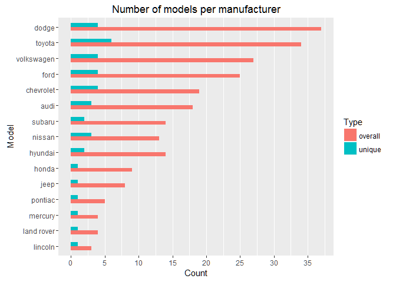

**Answer to the second part**: Which model has the most variation

``` r
unique(mpg$model)
```

    ##  [1] "a4"                     "a4 quattro"            
    ##  [3] "a6 quattro"             "c1500 suburban 2wd"    
    ##  [5] "corvette"               "k1500 tahoe 4wd"       
    ##  [7] "malibu"                 "caravan 2wd"           
    ##  [9] "dakota pickup 4wd"      "durango 4wd"           
    ## [11] "ram 1500 pickup 4wd"    "expedition 2wd"        
    ## [13] "explorer 4wd"           "f150 pickup 4wd"       
    ## [15] "mustang"                "civic"                 
    ## [17] "sonata"                 "tiburon"               
    ## [19] "grand cherokee 4wd"     "range rover"           
    ## [21] "navigator 2wd"          "mountaineer 4wd"       
    ## [23] "altima"                 "maxima"                
    ## [25] "pathfinder 4wd"         "grand prix"            
    ## [27] "forester awd"           "impreza awd"           
    ## [29] "4runner 4wd"            "camry"                 
    ## [31] "camry solara"           "corolla"               
    ## [33] "land cruiser wagon 4wd" "toyota tacoma 4wd"     
    ## [35] "gti"                    "jetta"                 
    ## [37] "new beetle"             "passat"

The `a4` and the `camry` both have a second model (the `a4 quattro` and the `camry solar`) Hence, only the `camry` has true model variation. To remove the redundant information we use functions from the `stringr` package.

``` r
require(stringr, quietly = TRUE)

str_trim(str_replace_all(unique(mpg$model), c("quattro" = "", "4wd" = "", 
                                     "2wd" = "", "awd" = "")))
```

### Exercises 2.3.1 (page 16)

``` r
rm(list = ls()) # clean 

ggplot(mpg, aes(cty, hwy)) +
  geom_point()
```

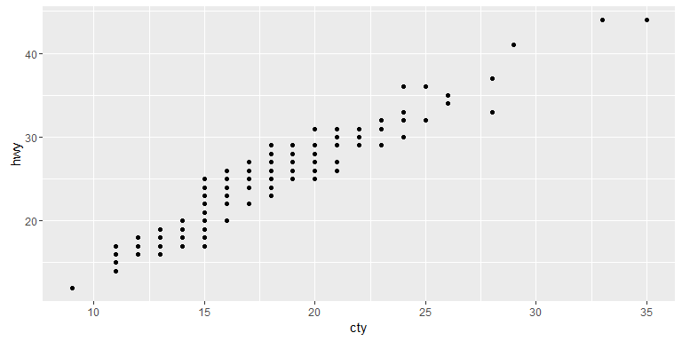

**Question 1**: How would you describe the relationship between `cty` and `hwy`? Do you have any concerns about drawing conclusions from that plot?
**Answer**: There is a clear linear relationship which is not surprising as both variables measure fuel economy. Hence, the there is not much inside to be gained except that cars which are fuel efficient on a highway are also fuel efficient in cities. This relationship is probably a function of speed.

**Question 2**: What does `ggplot(mpg, aes(model, manufacturer)) + geom_point()` show? Is it useful? How could you modify the data to make it more informative?

``` r
ggplot(mpg, aes(model, manufacturer)) + 
  geom_point()
```

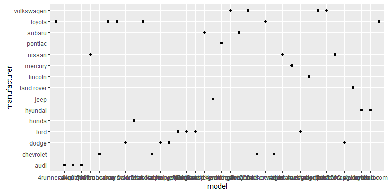

**Answer**: The plot is not useful for a number of reasons

-   Each dot represents a different manufacturer-model combination that we observe in the data. There is no inherent hierarchy so this is just a nominal scale.
-   As there is no interpretable relationship between the points, there is no inside to be gained from comparing positions (which is the very reason for a scatterplot).
-   Some of the data is hidden as some manufacturer-model combinations appear more than once in the data (e.g. `audi a4`).
-   Even if overplotting wouldn't concern us, it is very likely that each unique model only pairs with one manufacturer such that a two dimensional plot is redundant.

A possible alternative would be to look total number of observations for each manufacturer-model combination using `geom_bar()`.

``` r
df <- mpg %>% 
  transmute("man_mod" = paste(manufacturer, model, sep = " "))


ggplot(df, aes(man_mod)) +
  geom_bar() + 
  coord_flip()
```


**Question 3**: Describe the data, aesthetic mappings and layers used for each of the following plots. You'll need to guess a little because you haven't seen all the data sets and functions yet, but use your common sense! See if you can predict what the plot will look like before running the code.

    1. `ggplot(mpg, aes(cty, hwy)) + geom_point()`
    1. `ggplot(diamonds, aes(carat, price)) + geom_point()`
    1. `ggplot(economics, aes(date, unemploy)) + geom_line()`
    1. `ggplot(mpg, aes(cty)) + geom_histogram()`

**Answer**: You can always access info using `summary(<plot>)` as in e.g.

``` r
summary(ggplot(economics, aes(date, unemploy)) + geom_line())
```

    ## data: date, pce, pop, psavert, uempmed, unemploy [574x6]
    ## mapping:  x = date, y = unemploy
    ## faceting: facet_null() 
    ## -----------------------------------
    ## geom_line: na.rm = FALSE
    ## stat_identity: na.rm = FALSE
    ## position_identity

1.  **Data**: For the data see `?<dataset>`
2.  **Aesthetic mappings**: All mappings in this example are position mappings.
3.  **Layers**: There is one layer for each plot.

### Exercises 2.4.1 (page 18)

**Question 1**: Experiment with the color, shape and size aesthetics. What happens when you map them to continuous values? What about categorical values? What happens when you use more than one aesthetic in a plot?

**Answer**:

``` r
# Categorial
ggplot(mpg, aes(cty, displ, colour = class)) + 
  geom_point()

# Continuous 
ggplot(mpg, aes(cty, hwy, size = displ)) + 
  geom_jitter()

## Doesnt work for shape
ggplot(mpg, aes(cty, hwy, shape = displ)) + 
  geom_jitter()
```

All aesthetics that have a natural continuous scale can be used for both continuous and discrete variables.

**Question 2**: What happens if you map a continuous variable to shape? Why? What happens if you map `trans` to shape? Why?

**Answer**: As mentioned before: all aesthetics that have a natural continuous scale can be used for both continuous and discrete variables. Shape doesn't have a continuous scale so it throws an error. When a discrete variable has more than 6 different values its hard to discriminate hence we get a warning.

``` r
ggplot(mpg, aes(cty, hwy, shape = trans)) + 
  geom_point()
```

    ## Warning: The shape palette can deal with a maximum of 6 discrete values
    ## because more than 6 becomes difficult to discriminate; you have
    ## 10. Consider specifying shapes manually if you must have them.

    ## Warning: Removed 96 rows containing missing values (geom_point).

    ## Warning: The shape palette can deal with a maximum of 6 discrete values
    ## because more than 6 becomes difficult to discriminate; you have
    ## 10. Consider specifying shapes manually if you must have them.

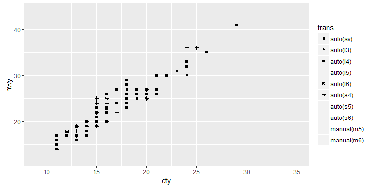

**Question 3**: How is drive train related to fuel economy? How is drive train related to engine size and class?

**Answer**:

``` r
ggplot(mpg, aes(drv, cty)) + 
  geom_boxplot() +
  scale_x_discrete(limits = c("f", "r", "4"),
                   labels = c("Front wheel", "Rear wheel", "Four wheel"))
```

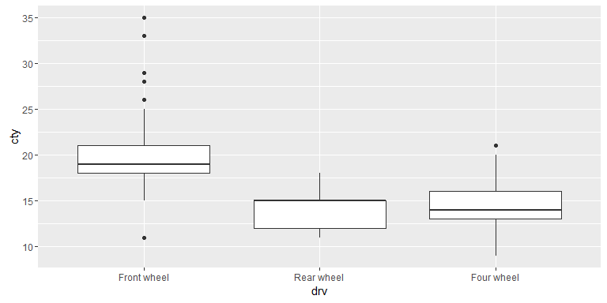

The boxplot is a good way of showing the relationship between a continous and a (factor) variable with just a few levels. To compare densities we could also use a violin plot

``` r
ggplot(mpg, aes(drv, cty)) + 
  geom_violin() +
  scale_x_discrete(limits = c("f", "r", "4"),
                   labels = c("Front wheel", "Rear wheel", "Four wheel"))
```

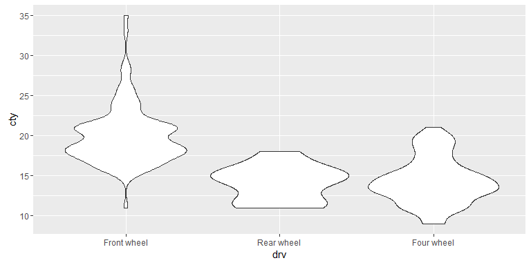 Front wheel cars are most efficient in terms of fuel economy (the picture is almost identical for higway mpg).

To compare drive train (`drv`), engine size (`displ`) and `class` i suggest a scatterplot with some horizontal jittering to avoid overplotting (no vertical jittering, as this would incorrectly change the original values of `displ`)

``` r
ggplot(mpg, aes(reorder(class, displ, FUN = median), displ, colour = drv)) + 
  geom_jitter(width = 0.5, height = 0)
```


### Exercises 2.5.1 (page 19)

**Question 1**: What happens if you try to facet by a continuous variable like `hwy`? What about `cyl`? What's the key difference?

**Answer**: Facetting by a continous variable works but becomes hard to read and interpret when the variable that we facet by has to many levels. The following plot is therefore rather hard to read and therefore meaningless.

``` r
ggplot(mpg, aes(displ, cty)) + 
  geom_point() +
  facet_wrap(~ hwy)
```

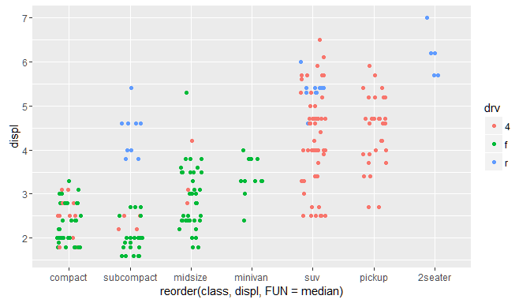

This is much easier to grasp

``` r
ggplot(mpg, aes(displ, cty)) + 
  geom_point() +
  geom_smooth(method = "lm") +
  facet_wrap(~ cyl)
```

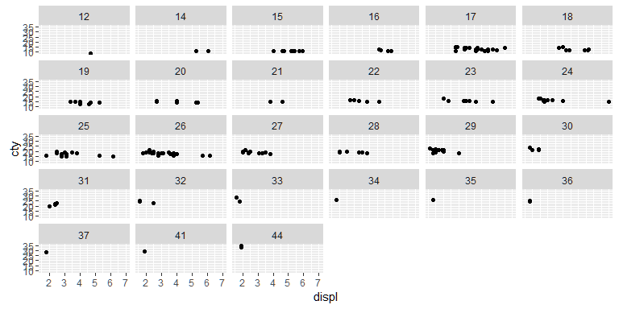

**Question 2**: Use facetting to explore the 3-way relationship between fuel economy, engine size, and number of cylinders. How does facetting by number of cylinders change your assessement of the relationship between engine size and fuel economy?

**Answer**: As can be seen from the above plot: the relationship differs by cylinder number. While there is no reasonable relationship between `cyt` and `disp` for 5 cylinder cars, it is negative for 4 cylinder cars, less pronounced but still negative for 6 cylinder cars and postive for 8 cylinder cars.

**Question 3**: Read the documentation for `facet_wrap()`. What arguments can you use to control how many rows and columns appear in the output?

**Answer**: `?facet_wrap`: the arguments are `nrow` and `ncol`.

**Question 4**: What does the `scales` argument to `facet_wrap()` do? When might you use it?

**Answer**: By default `facet_wrap` uses the same scales for each facet. Scales define how the data is mapped to aestetics. To take an example: assume that the values `f` of the variable `drv` is mapped to the colour *red* by scales. The default behaviour of `facet_wrap` is to use *red* for `f` in every possible facet. As noted in the help file, this is reasonable if we want to compare across facets. If our focus is on individual patterns within each facet, setting `scales = "free"` might be more approriate.

### Exercises 2.6.6 (page 29)

**Question 1**: What's the problem with the plot created by `ggplot(mpg, aes(cty, hwy)) + geom_point()`? Which of the geoms described above is most effective at remedying the problem?

**Answer**: The problem is overplotting. Two possible strategies:

1.  Use jittering via `geom_jitter`

``` r
ggplot(mpg, aes(cty, hwy)) +
  geom_jitter()
```

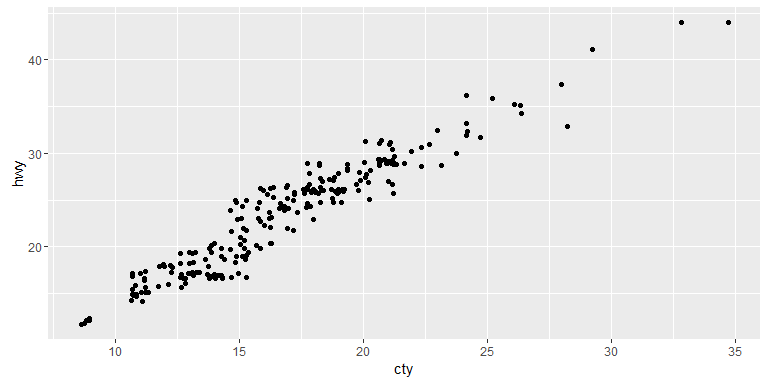

1.  Set the opacity with the option `alpha`

``` r
ggplot(mpg, aes(cty, hwy)) +
  geom_point(alpha = 0.3)
```

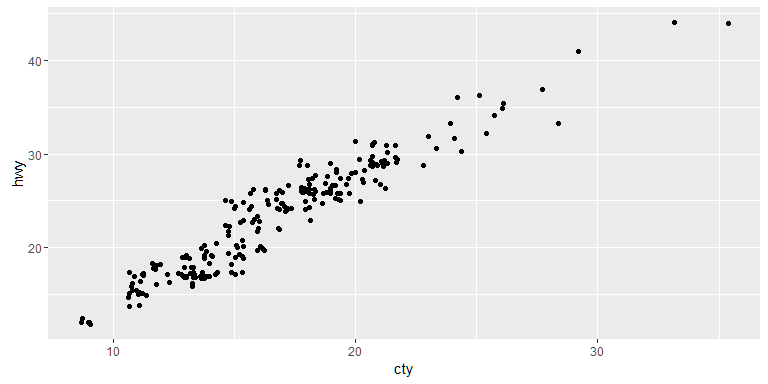

**Question 2**: One challenge with `ggplot(mpg, aes(class, hwy)) + geom_boxplot()` is that the ordering of `class` is alphabetical, which is not terribly useful. How could you change the factor levels to be more informative? Rather than reordering the factor by hand, you can do it automatically based on the data: `ggplot(mpg, aes(reorder(class, hwy), hwy)) + geom_boxplot()`. What does `reorder()` do? Read the documentation.

**Answer**: `reorder` takes a variable and orders its levels (or unique values) based on the values of the second variable. If the second variable is numeric `reorder` by default orders by mean, this can be changed to e.g. the median.

``` r
ggplot(mpg, aes(reorder(class, hwy, FUN = median), hwy)) +
  geom_boxplot()
```

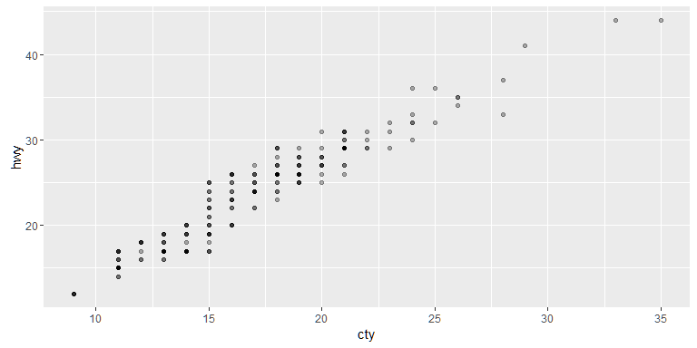

**Question 3**: Explore the distribution of the carat variable in the `diamonds` dataset. What binwidth reveals the most interesting patterns?

**Answer**:

``` r
diamonds ## look at the data
```

    ## Source: local data frame [53,940 x 10]
    ## 
    ##    carat       cut  color clarity depth table price     x     y     z
    ##    (dbl)    (fctr) (fctr)  (fctr) (dbl) (dbl) (int) (dbl) (dbl) (dbl)
    ## 1   0.23     Ideal      E     SI2  61.5    55   326  3.95  3.98  2.43
    ## 2   0.21   Premium      E     SI1  59.8    61   326  3.89  3.84  2.31
    ## 3   0.23      Good      E     VS1  56.9    65   327  4.05  4.07  2.31
    ## 4   0.29   Premium      I     VS2  62.4    58   334  4.20  4.23  2.63
    ## 5   0.31      Good      J     SI2  63.3    58   335  4.34  4.35  2.75
    ## 6   0.24 Very Good      J    VVS2  62.8    57   336  3.94  3.96  2.48
    ## ..   ...       ...    ...     ...   ...   ...   ...   ...   ...   ...

``` r
# trial and error leads to binwidth 
bins = 200
ggplot(diamonds, aes(x = carat)) +
  geom_histogram(bins = bins) +
  scale_x_continuous(limits = c(0, 2), expand = c(0,0), breaks = seq(0,2,0.1))
```

    ## Warning: Removed 1889 rows containing non-finite values (stat_bin).

    ## Warning: Removed 2 rows containing missing values (geom_bar).

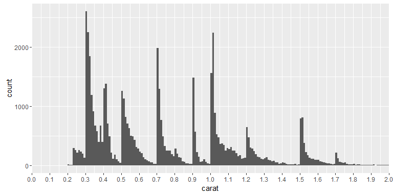

With a the number of bins set to 200 Beginning at 0.3 carat there is a spike in the number of diamonds at 0.3, 0.5, 0.7, 0,9, 1, 1.2 and 1.5. I am no diamonds expert but there is probably a reason for this pattern.

**Question 4**: Explore the distribution of the price variable in the `diamonds` data. How does the distribution vary by cut?

**Answer**:

``` r
bins = 200
ggplot(diamonds, aes(x = price)) +
  geom_histogram(bins = bins) +
  facet_wrap(~cut, scales = "free")
```

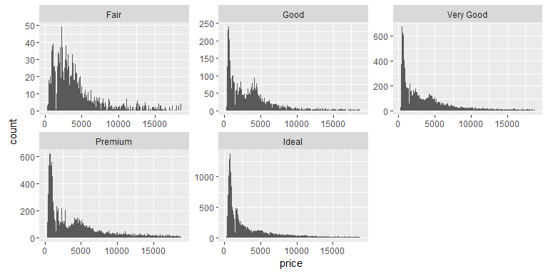

Or alternatively using a frequency polygon

``` r
ggplot(diamonds, aes(x = price, y =..density.., color = cut)) +
  geom_freqpoly(binwidth = 200)
```


Fair quality diamonds are more expensive then others. Possible reason: they are bigger.

**Question 5**: You now know (at least) three ways to compare the distributions of subgroups: `geom_violin()`, `geom_freqpoly()` and the colour aesthetic, or `geom_histogram()` and facetting. What are the strengths and weaknesses of each approach? What other approaches could you try?

**Answer**: to be done

**Question 6**: Read the documentation for `geom_bar()`. What does the `weight` aesthetic do?

    ?geom_bar

**Question 7**: Using the techniques already discussed in this chapter, come up with three ways to visualise a 2d categorical distribution. Try them out by visualising the distribution of `model` and `manufacturer`, `trans` and `class`, and `cyl` and `trans`.
